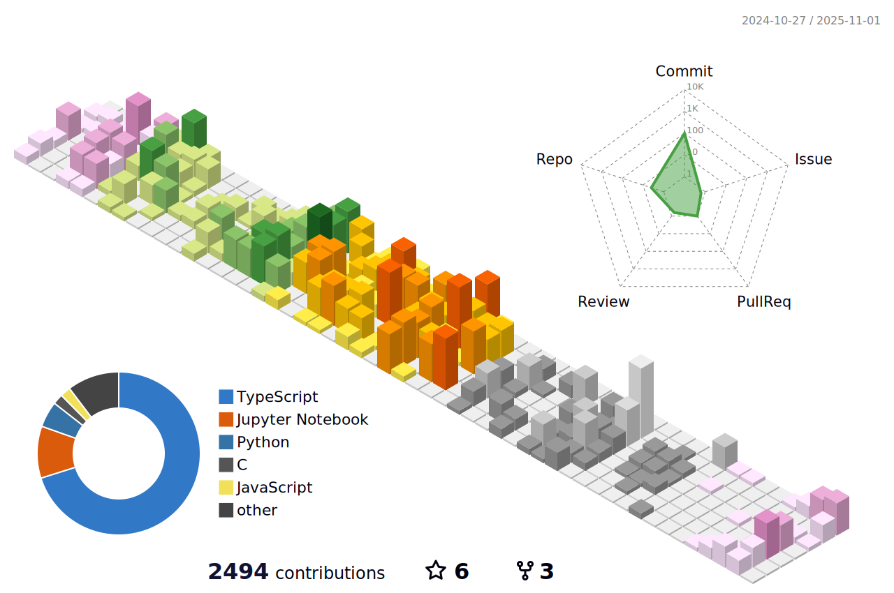

### 👋 Olá, sou William Cardoso!

🎓 **Bacharel em Ciência da Computação (UNIR)** | **Especialização em IA Aplicada (UFPR – em andamento)**  
👨‍💻 **Backend & AI Developer | Pesquisador Científico | Tech for Sustainability**  
🚀 **Co-fundador da [Ecotech Amazônia](https://www.ecotechamazonia.com.br)**

---

---

|  |  |
| ----------- | ----------- |

---

---

  

---

### 🌟 Sobre mim

- 🔬 **Pesquisador na FIOTEC / Fiocruz Rondônia:** Visão computacional aplicada à saúde pública e meio ambiente.
- 🚀 **Gerente de Projetos  na Ecotech Amazônia:** Fudador da Ecotech Amazônia uma empresa parceira tecnologíca das grandes e pequenas empresas da Região Amazônica.
- 🏆 **Premiações:** ICPC Nacional, Hackthon Rondônia Rural Show, Rocket Amazônia Tech Reality.
- 🌎 **Experiência Internacional:** Full Stack Developer remoto nos EUA (Goat Tech).

---

### 📌 Destaques de Projetos

- 💡 **Eggs Fiocruz:** Visão computacional para análise epidemiológica a partir da contagem de ovos de mosquitos do Aedes aegypti. [GitHub](https://github.com/williancarddd/eggs-fiocruz-back)
- 💡 **Detecção Automatizada de Malária:** Visão computacional para análises de imagens médicas para detecção de malária. [Artigo](https://ri.unir.br/jspui/handle/123456789/5661?mode=full)
- 💡 **Inclusão De Surdos:** Visão computacional para detecção e criação de palavras a partir de gestos de libras. [Github](https://github.com/williancarddd/IA-Libras.git)
- 💡 **Aquicultura Sustentável 4.0:** Diagramou, desenvolveu e gerenciou uma equipe para criação da plataforma de manejo de Pisiculturas  [Site Institucional](https://www.aquiculturasustentavelro.com.br/)
- 💡 **GoDental CRM:** Sistema odontológico para o mercado norte-americano.
- 💡 **Conecte Cacau:** Visão computacional para monitoramento do cacau.

---

### 📫 Contatos

